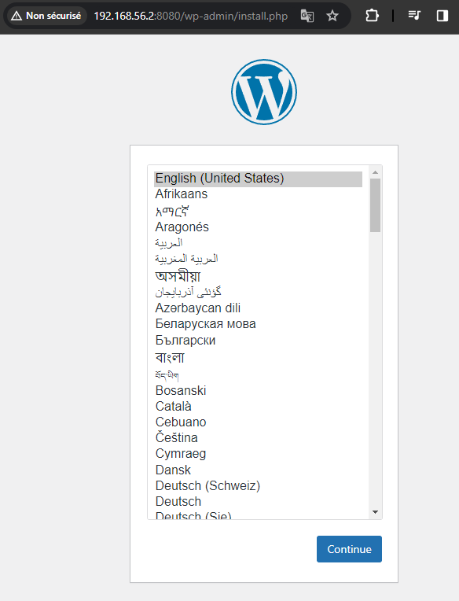

# Déploiement de l'environnement de test local pour WordPress

Ce dépôt permet de déployer un environnement de test local pour WordPress en utilisant Docker et Vagrant.

## Prérequis

- Installez VirtualBox, Vagrant et Git sur votre machine.

## Contenu du dépôt

- `Vagrantfile`: Un fichier de configuration Vagrant pour spécifier les paramètres de la machine virtuelle.
- `install-docker.sh`: Un script shell pour installer Docker, Docker-compose et lancer les conteneurs Wordpress et MySQL sur la machine virtuelle.
- `docker-compose.yml`: Un fichier de configuration Docker-compose pour définir les services WordPress et MySQL.
-  `db_password.txt` et `db_root_password`: Deux fichiers texte pour définir les secrets. N'oubliez pas de personnaliser vos secrets.
  
## Instructions d'utilisation

1. Clonez ce dépôt sur votre machine locale :

    ```bash
    git clone https://github.com/MassiTZ/Projet01-Docker.git

2. Changez de répertoire vers le dépôt cloné :

   ```bash
   cd Projet01-Docker

3. Personnalisez les mots de passe dans les fichiers `db password.txt` et `db root password`.
4. Démarrez la machine virtuelle Vagrant en exécutant la commande suivante :
   
    ```bash
    vagrant up
  - Cela lancera une machine virtuelle Ubuntu avec Docker et Docker-compose installé. Et lancera aussi les conteneurs Docker pour WordPress et MySQL.

## Accès à WordPress

 - Une fois que les services sont lancés, vous pouvez accéder à votre site WordPress en ouvrant un navigateur web et en visitant l'adresse http://192.168.56.2:8080.

 
      
   

   
